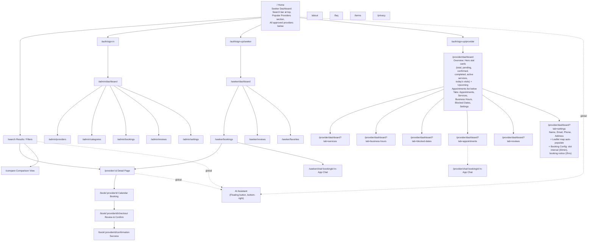
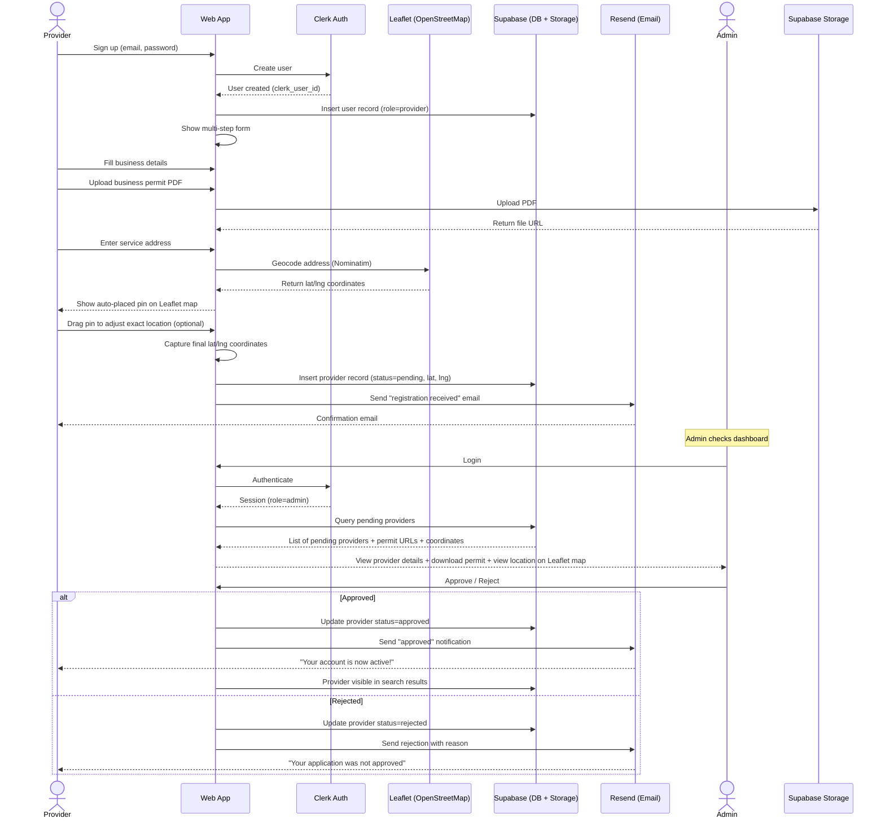
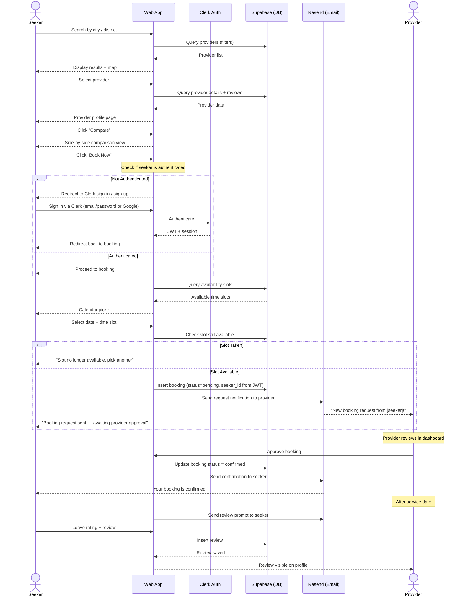
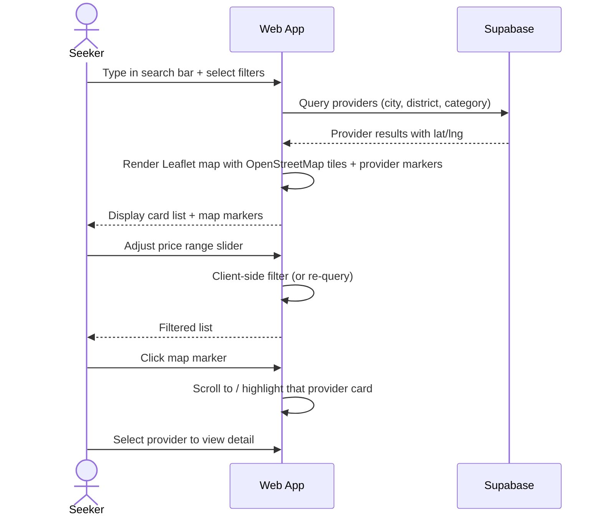
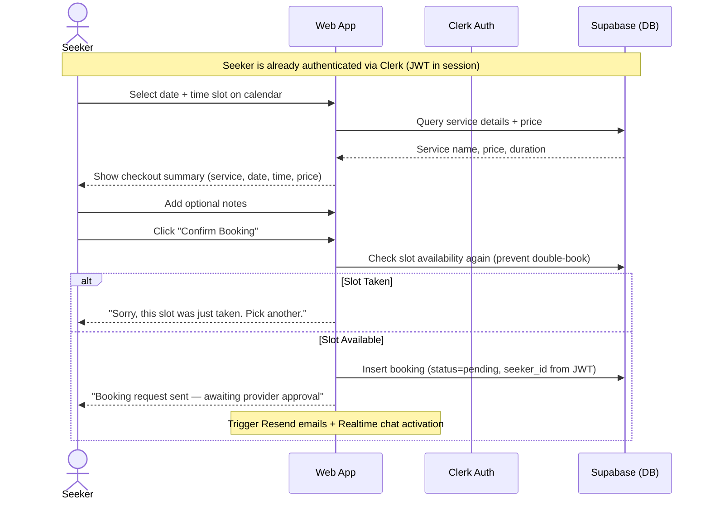
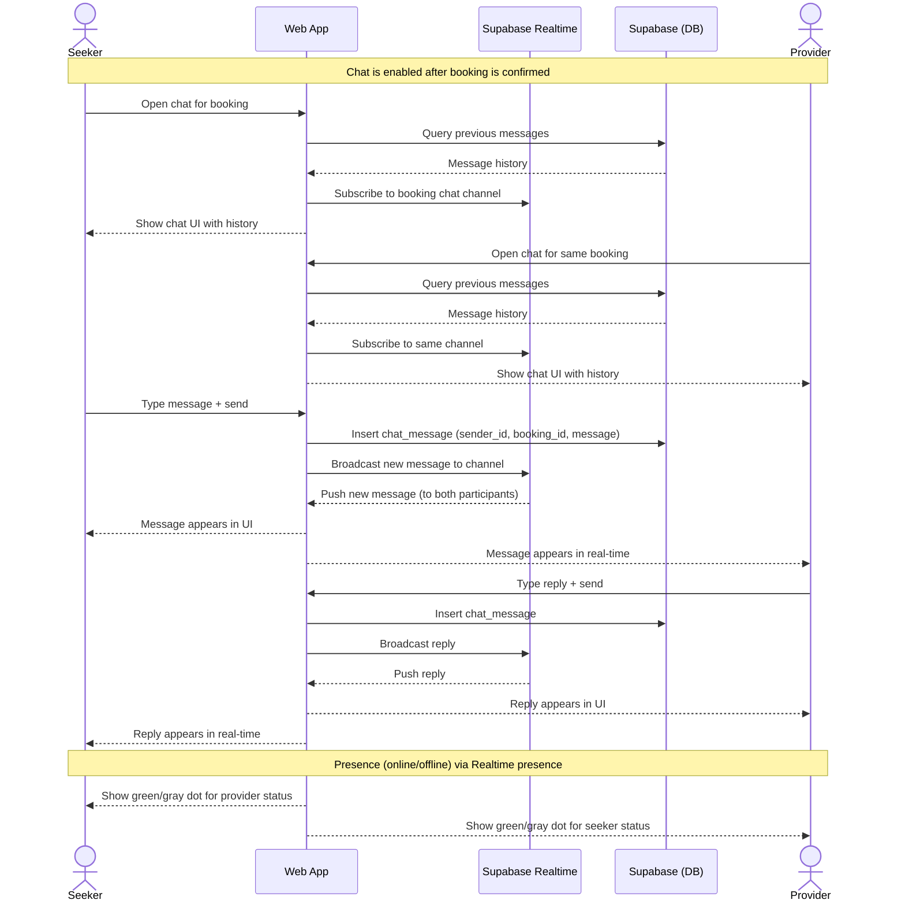
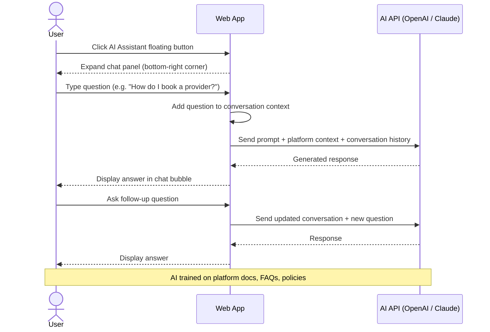

# Serch — Diagrams

Copy/paste any block into [mermaid.ai](https://mermaid.ai) to render.

---

## 1. Site Map (Navigation Structure)



---

## 2. Role-Based Access Control (RBAC) Matrix

```mermaid
graph LR
    sublegend["Legend:
    CRUD = Create / Read / Update / Delete
    R    = Read-only
    --   = No access"]

    subgraph Seeker["Seeker Role"]
        S1["Browse / Search Providers"]
        S2["Compare Providers"]
        S3["View Provider Details (verified badge, reviews, availability)"]
        S4["Book Appointment (Calendar + Checkout)"]
        S5["Manage Own Bookings"]
        S6["In-App Chat with Provider (active bookings only)"]
        S7["Write Reviews (locked after submission)"]
        S8["Save Favorites"]
        S9["AI Assistant (Q&A chatbot)"]
        S10["Edit Own Profile"]
    end

    subgraph Provider["Provider Role"]
        P1["Dashboard Overview (stat cards + upcoming appointments list)"]
        P2["Manage Services (CRUD)"]
        P3["Set Business Hours (weekly recurring)"]
        P4["Block Specific Dates (one-off)"]
        P5["Manage Appointments (view/confirm/complete/cancel)"]
        P6["In-App Chat with Seekers (active bookings only)"]
        P7["View & Respond to Reviews"]
        P8["Settings (profile, account, notifications)"]
        P9["Display Verified Badge"]
        P10["Upgrade Plan"]
    end

    subgraph Admin["Admin Role"]
        A1["Platform Dashboard (All Stats)"]
        A2["Provider CRUD + Approve / Reject"]
        A3["Toggle Provider Verified Status"]
        A4["Category CRUD"]
        A5["View All Bookings"]
        A6["Moderate Reviews (remove inappropriate)"]
        A7["Platform Settings"]
    end

    S1 -.->|R| SearchDB[("Database")]
    S2 -.->|R| SearchDB
    S3 -.->|R| SearchDB
    S4 -.->|CRUD| BookDB[("Bookings Table")]
    S5 -.->|CRUD| BookDB
    S6 -.->|CRUD| ChatDB[("Chat Messages Table")]
    S7 -.->|CRUD| ReviewDB[("Reviews Table")]
    S8 -.->|CRUD| FavDB[("Favorites Table")]
    S9 -.->|R| AIDB[("AI Knowledge Base")]
    S10 -.->|CRUD| UserDB[("Users Table")]

    P1 -.->|R| AggDB[("Aggregated Stats")]
    P2 -.->|CRUD| ServiceDB[("Services Table")]
    P3 -.->|CRUD| AvailDB[("Business Hours Table")]
    P4 -.->|CRUD| BlockDB[("Blocked Dates Table")]
    P5 -.->|R / Update| BookDB
    P6 -.->|CRUD| ChatDB
    P7 -.->|R| ReviewDB
    P8 -.->|CRUD| UserDB
    P9 -.->|R| ProvDB[("Providers Table")]

    A2 -.->|CRUD| ProvDB
    A3 -.->|Update| ProvDB
    A4 -.->|CRUD| CatDB[("Categories Table")]
    A5 -.->|R| BookDB
    A6 -.->|CRUD| ReviewDB
    A7 -.->|CRUD| SettingsDB[("Platform Settings Table")]
```



---

## 3. Data Flow Diagrams

### 3.1 Provider Onboarding Flow



### 3.2 Booking Flow



### 3.3 Search & Filter Data Flow



### 3.4 Booking Checkout Flow



### 3.5 In-App Chat Flow



### 3.6 AI Assistant Flow



---

## 4. Database Schema (Entity Relationship)

```mermaid
erDiagram
    users {
        uuid id PK
        string clerk_user_id UK
        string email UK
        string full_name
        string phone
        enum role
        string avatar_url
        timestamp created_at
    }

    providers {
        uuid id PK
        uuid user_id FK
        string business_name
        text description
        string logo_url
        text service_categories
        string service_city
        string service_district
        float latitude
        float longitude
        string website
        string business_permit_url
        boolean is_verified
        enum status
        enum plan
        timestamp created_at
    }

    services {
        uuid id PK
        uuid provider_id FK
        uuid category_id FK
        string name
        text description
        float price
        int duration_minutes
        text images
        boolean is_active
    }

    categories {
        uuid id PK
        string name
        string slug UK
        string icon
        boolean is_active
    }

    bookings {
        uuid id PK
        uuid seeker_id FK
        uuid provider_id FK
        uuid service_id FK
        date booking_date
        time start_time
        time end_time
        enum status
        text notes
        timestamp created_at
    }

    reviews {
        uuid id PK
        uuid booking_id FK UK
        uuid seeker_id FK
        uuid provider_id FK
        int rating
        text comment
        boolean is_locked
        timestamp created_at
    }

    provider_availability {
        uuid id PK
        uuid provider_id FK
        int day_of_week
        time start_time
        time end_time
        boolean is_available
    }

    blocked_dates {
        uuid id PK
        uuid provider_id FK
        date date
        boolean is_available
        string reason
    }

    chat_messages {
        uuid id PK
        uuid booking_id FK
        uuid sender_id FK
        text message
        timestamp created_at
    }

    users ||--o{ providers : "has (if role=provider)"
    providers ||--o{ services : "offers"
    categories ||--o{ services : "belongs to"
    users ||--o{ bookings : "as seeker"
    providers ||--o{ bookings : "receives"
    services ||--o{ bookings : "for"
    bookings ||--o| reviews : "has one"
    users ||--o{ reviews : "writes (as seeker)"
    providers ||--o{ reviews : "receives"
    providers ||--o{ provider_availability : "sets weekly hours"
    providers ||--o{ blocked_dates : "blocks dates"
    bookings ||--o{ chat_messages : "has many"
    users ||--o{ chat_messages : "sends"
```

---

## 5. Architecture Overview

```mermaid
graph TD
    subgraph Client["Client (Browser)"]
        NextApp["Next.js App
        (React + Tailwind CSS)
        Mobile-First Responsive"]
        ClerkFE["Clerk.js
        Auth Components"]
        AIWidget["AI Assistant Widget
        (Floating bottom-right)"]
        LeafletMap["Leaflet Map (OpenStreetMap)
        Free tiles, no API key
        Auto-pin + drag to adjust"]
    end

    subgraph Vercel["Vercel (Hosting)"]
        NextApp
    end

    subgraph Supabase["Supabase (Backend)"]
        Postgres[("PostgreSQL
        Database")]
        Storage["File Storage
        (Business Permits, Photos)"]
        Realtime["Realtime
        (Chat + Presence + Slot Updates)"]
    end

    subgraph Clerk["Clerk (Auth)"]
        ClerkAPI["Auth API
        Email/Password + Google OAuth"]
    end

    subgraph External["External Services"]
        Resend["Resend
        (Transactional Emails)"]
        AIAPI["AI API
        (OpenAI / Claude)"]
    end

    ClerkFE <-->|Auth Sessions| ClerkAPI
    NextApp <-->|API Queries (RLS)| Postgres
    NextApp <-->|File Uploads| Storage
    NextApp <-->|Chat Messages + Presence| Realtime
    NextApp <-->|Slot Updates| Realtime
    NextApp -->|Email Notifications| Resend
    AIWidget -->|Q&A Prompts| AIAPI
    LeafletMap -->|Tile requests (free)| OSM[("OpenStreetMap
    CDN")]
    ClerkAPI -->|Webhook: user created| Postgres

    style Client fill:#F8FAFC,stroke:#0F172A
    style Vercel fill:#F8FAFC,stroke:#0F172A
    style Supabase fill:#F8FAFC,stroke:#0F172A
    style Clerk fill:#F8FAFC,stroke:#0F172A
    style External fill:#F8FAFC,stroke:#0F172A
```
